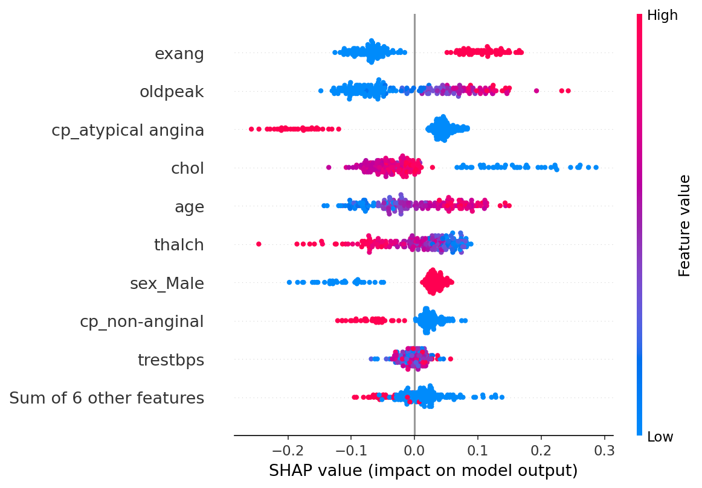
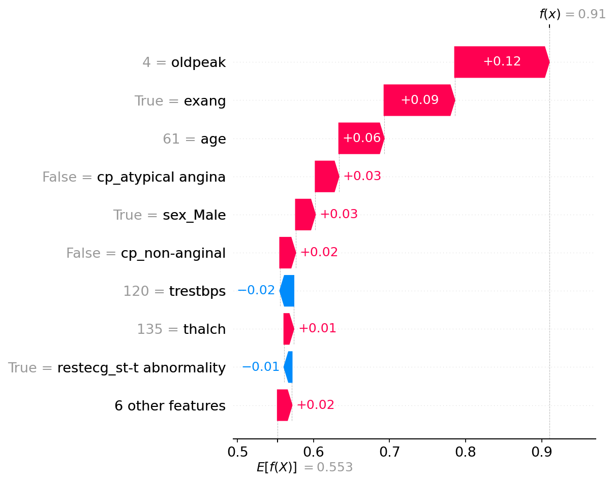
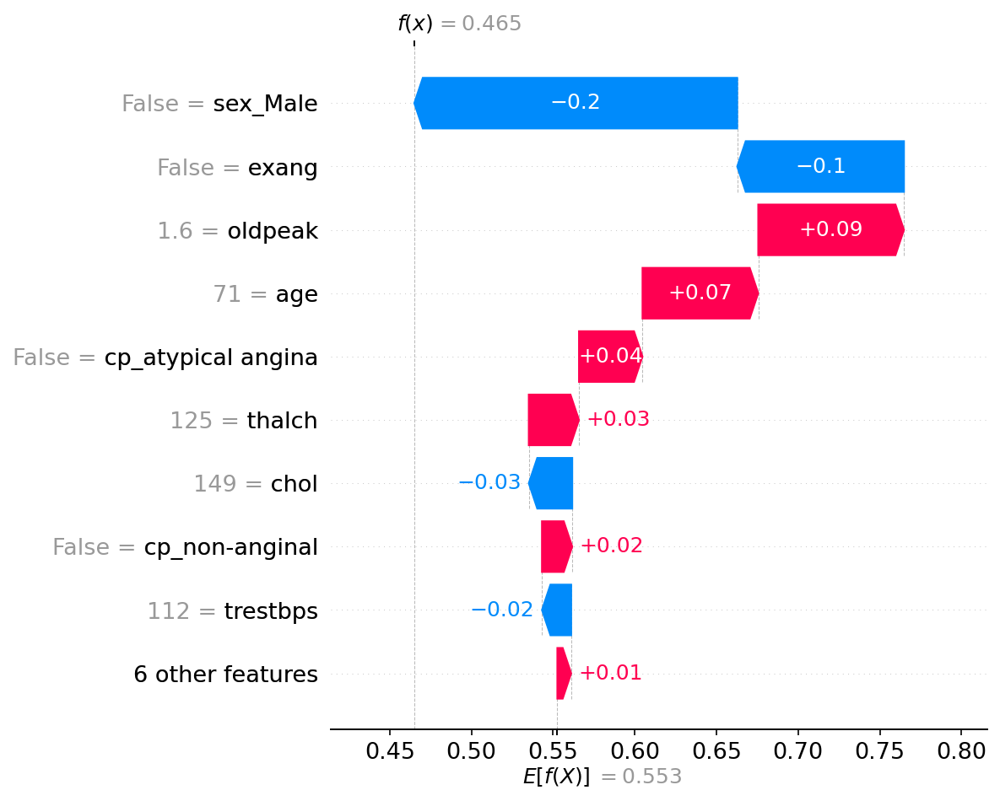
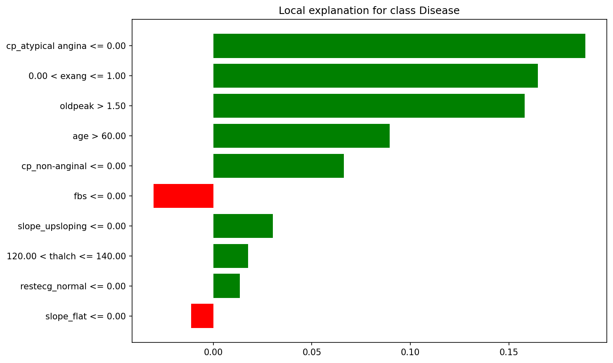
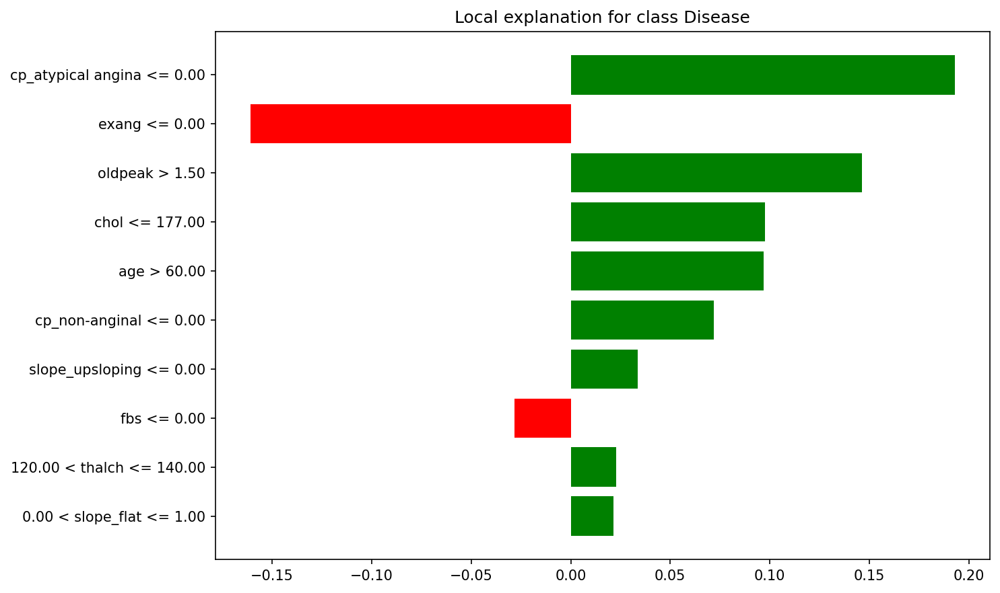
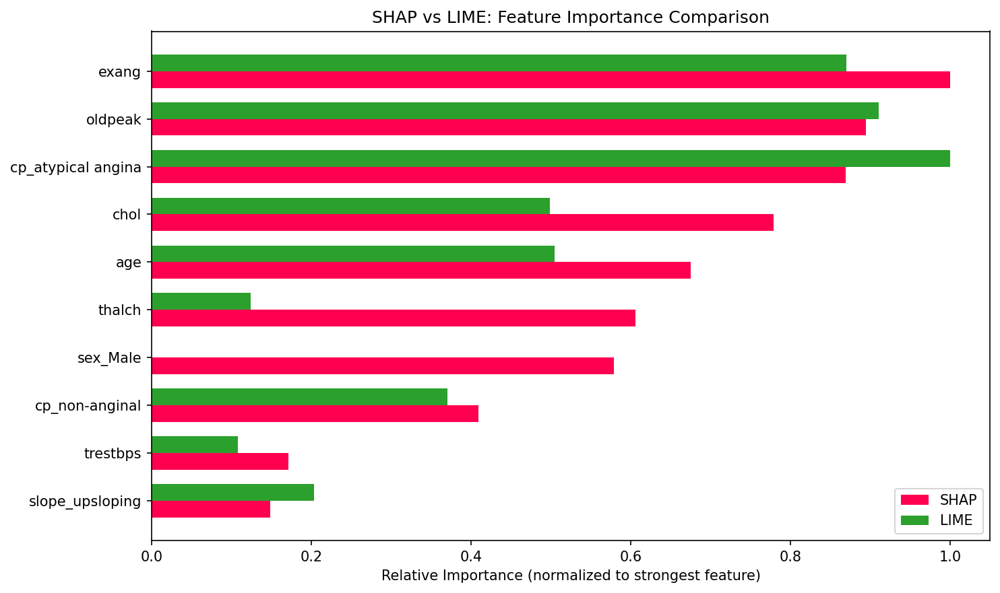

# Why Did My Model Predict That? SHAP and LIME on Heart Disease Data

*Part 4 of the AI-enhanced productivity series: Automation, Sentiment, and Explainability*

---

The W2 project asked whether automation improves ML workflows. W3 tested whether AI tools accelerate text analysis. W4 closes the series with a different concern: can we explain what a model is doing, and should we trust it?

## The Setup

The dataset: 920 patient records from multiple clinical centers (the full Heart Disease UCI dataset, not the commonly used 303-row Cleveland subset). Thirteen clinical features, age, sex, chest pain type, blood pressure, cholesterol, exercise test results, and a binary target: heart disease present or absent.

The tool stack: Random Forest and XGBoost for modeling, SHAP for global and local explanations, LIME for local rule-based explanations.

## Model Performance

Both models performed well. Random Forest edged out XGBoost across all metrics:

| Metric | Random Forest | XGBoost |
|--------|--------------|---------|
| Accuracy | 0.837 | 0.826 |
| AUC | 0.901 | 0.877 |
| Recall | 0.882 | 0.853 |

The 88% recall is particularly relevant in healthcare: the model catches most disease cases, which matters more than occasional false positives when screening for heart disease. Random Forest was selected for explainability analysis.

## What SHAP Reveals

SHAP's global view (beeswarm and bar plots) identified the top predictors: exercise-induced angina (`exang`), ST depression (`oldpeak`), chest pain type, cholesterol, and age. These are well-established cardiac risk indicators in medical literature, which is reassuring: the model learned clinically meaningful patterns rather than spurious correlations.

The beeswarm plot adds directionality. Exercise angina present pushes strongly toward disease. Higher ST depression increases disease probability. Being male slightly increases risk. Higher maximum heart rate is protective, consistent with better cardiac fitness.

The waterfall plots tell individual stories. A 61-year-old male with oldpeak=4 and exercise angina was correctly predicted as disease (f(x)=0.91), with every major feature contributing in the same direction.

A 71-year-old female with no exercise angina was correctly predicted as no disease (f(x)=0.465), despite age and oldpeak pushing toward disease, because being female and having no exercise angina were strong enough protective factors.

## What LIME Adds

LIME explains the same cases differently. Instead of additive SHAP values, it provides rule-based conditions: "oldpeak > 1.50" pushes toward disease, "exang <= 0.00" pushes away. These rules are more intuitive for non-technical audiences; a clinician can map "oldpeak > 1.50" directly to a test result on the patient's chart.

Both tools agree on the top features. The normalized comparison chart confirms that exang, oldpeak, and chest pain type rank highest in both SHAP and LIME. The relative weighting differs because SHAP averages across all 184 test samples while LIME explains only individual cases, but the ranking alignment provides confidence that the model's behavior is consistent.

## The Misclassification Lesson

The initial waterfall plots selected cases without checking whether the model predicted them correctly. Both turned out to be misclassifications. This was a useful accident: it showed that SHAP's reasoning can be clinically plausible even when the prediction is wrong. A 71-year-old with multiple risk factors predicted as disease when they were healthy, the model's reasoning made sense even though the outcome was incorrect.

We regenerated the plots with correctly classified cases for the main analysis, but the misclassified examples reinforced why explainability matters: understanding the reasoning behind a wrong prediction is just as important as understanding a correct one.

## Trust in Healthcare

A model that outputs "disease" or "no disease" without explanation is insufficient in healthcare. Clinicians need to see why. The waterfall plots provide exactly this: a doctor can verify that exercise angina and ST depression drove a positive prediction, both findings they can check against the patient's actual test results.

This transparency enables three outcomes that black-box predictions cannot: the clinician can agree with the model, disagree and override it, or request additional tests to resolve ambiguity. All three are better than blind acceptance or rejection.

## The Series in Retrospect

Across three projects, the role of AI shifted:

- **W2 (Automation):** AI replaced manual steps. PyCaret compared 15 models in three lines of code; the productivity gain was measurable (R² +0.12 over baseline).
- **W3 (Assistance):** AI augmented analysis. A pre-trained sentiment model classified tweets with no labeled data; the gain was in eliminating the labeling bottleneck.
- **W4 (Accountability):** AI supported transparency. SHAP and LIME did not improve predictions; they made predictions understandable.

The common thread: AI tools amplify productivity, but human judgment remains essential. Choosing the right model, interpreting results, deciding when to trust or override, these are not automatable. The most valuable AI tools are the ones that make human judgment easier, not the ones that try to replace it.
